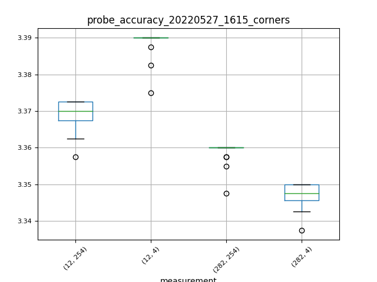
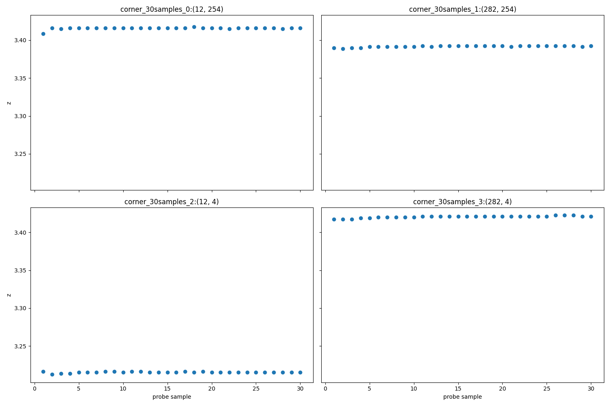
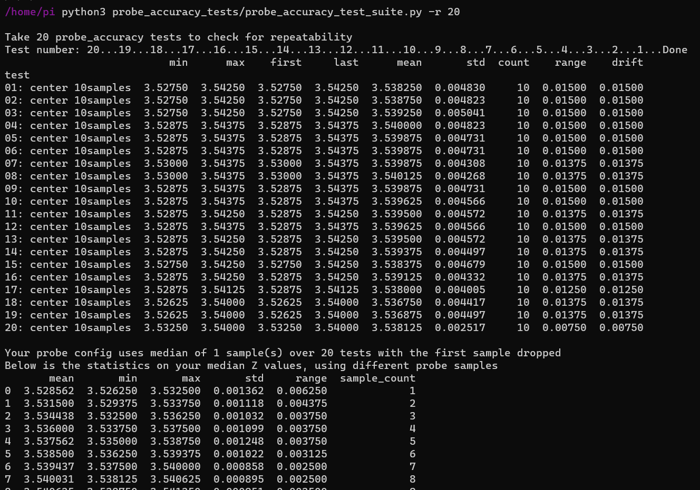
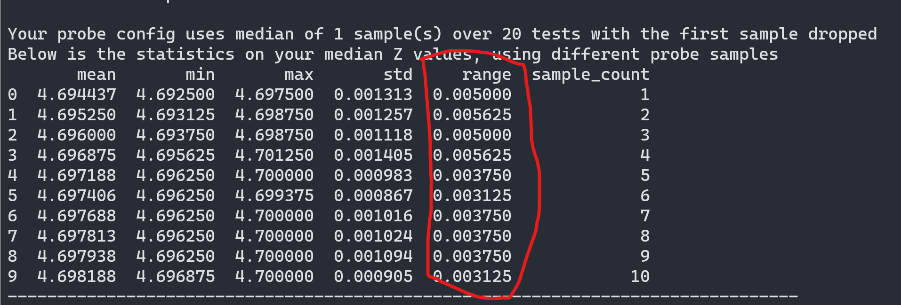
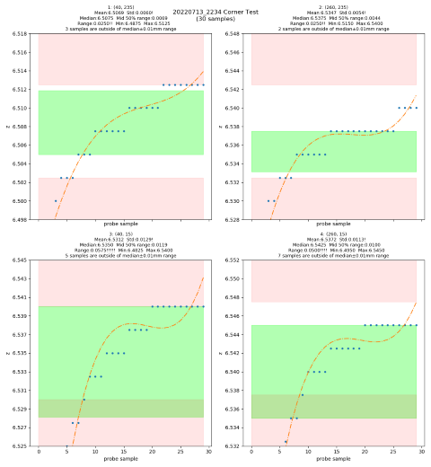

# Automated probe accuracy testing

`probe_accuracy_test_suite.py` is a collection of tests to help checking probe accuracy, precision and drift under different conditions.

### Default Tests Included

* 1 test, 30 samples at each bed mesh corners - check if there are issues with individual z drives. 
* 20 tests, 10 samples at bed center - check consistency within normal measurements
* 1 test, 100 samples at bed center - check for drift

## Changelog
I'm making updates as I receive feedback from the community on what tests are actually useful

* 2022-06-09: Allow passing probe_accuracy parameters and generating statistics on repeatability tests 

### Installation

On your printer:
```
curl -sSL https://raw.githubusercontent.com/sporkus/probe_accuracy_tests/master/install.sh | bash
```
will clone/pull this repo and install the uncessary python packages. 

### How to 

Use `python3 $HOME/probe_accuracy_tests/probe_accuracy_test_suite.py --help` to see all the options

#### Tests
* Run all three tests: `python3 $HOME/probe_accuracy_tests/probe_accuracy_test_suite.py` 
* Enable tests individually with `--corner`/`-c`, `--repeatability`/`-r`, `--drift`/`-d`
* Test parameters can be further specified: 
    * corner test, 10 samples each: `--corner 10`
    * 5 Repeatability tests: `--repeat 5`
    * 50 probe samples drift test: `--drift 50`

#### Other options
* add `--speedtest` to test a range of z-probe speed. Speed parameters are entered in interactive menu. 
* add `--force_dock` to force probe docking between tests to check docking issues
* add `--export_csv` to export data as csv 
* add `--speed`/`-retract` for probe speed/retract distance override
* add `--keep_first` to force keeping first probe sample even if it's configured to be dropped normally 


### Requirements

#### Python

See [requirements.txt](requirements.txt)

They will installed by installtion script above. If they are not installed - they can be installed like this manually.

```pip3 install -r requirements.txt```

#### Printer

* Need klicky macros properly configured, so that homing/leveling/probe accuracy gcodes
will pick up the probe safely.
* There was an issue that prevented running `PROBE_ACCURACY` near the front of the bed in [klicky-macros.cfg](https://github.com/jlas1/Klicky-Probe/blob/main/Klipper_macros/klicky-macros.cfg).  This was fixed on 2022/05/30.  Please update your config file if you see this error msg: `Must perform PROBE_ACCURACY with the probe above the BED!"` .

### Output

All graphs and data are saved to `$HOME/probe_accuracy_tests/output`. Enable csv export with `--export_csv` flag. 

Plot examples:




Terminal:




### Interpreting results
* The green area is the middle 50% range of your samples. The narrower this band is, the more precise your probe is.
* The red area falls outside of median +-0.005mm. If you have a lot of samples in the red area, you MAY have issue (but not necessarily).
* Graphs are fancy and helpful to find glaring issues, but it is unnessary to chase the most perfect graphs.
* If your repeatability range is 0.1mm or less, it should be sufficient to produce a good bed mesh. Increasing probe sample count (set in `printer.cfg` > `[probe]` > `samples`) can help sometimes.

    


### Common Issues
* On voron V2 printers, the most common issue is loose z-belts. An example from a printer with loose belt: 
    
* Getting probe sample exceeding samples_tolerance error: increase `[probe]:sample_tolerance` to 0.02. This has no effect on the actual accuracy of your probe.

