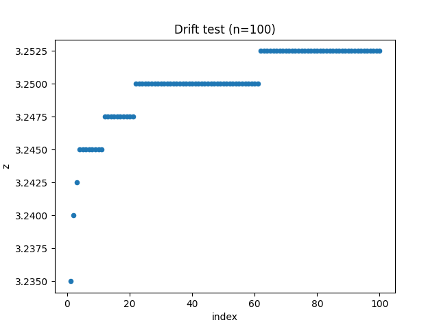
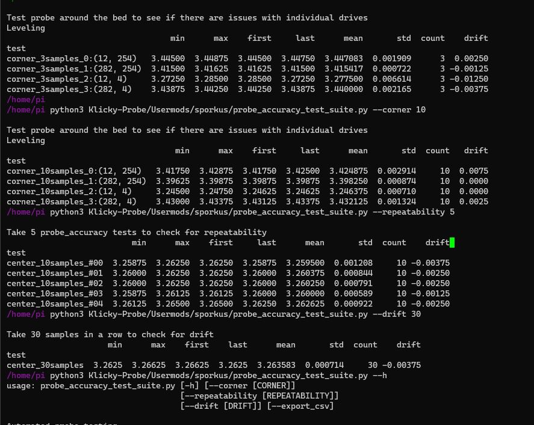

# Automated probe accuracy testing

`probe_accuracy_test_suite.py` is a collection of tests to help checking probe accuracy, precision and drift under different conditions.

### Default Tests Included

* 1 test, 30 samples at each bed mesh corners - check if there are issues with individual z drives. 
* 20 tests, 10 samples at bed center - check consistency within normal measurements
* 1 test, 100 samples at bed center - check for drift


### Installation

On your printer:
```
curl -sSL https://raw.githubusercontent.com/sporkus/probe_accuracy_tests/master/install.sh | bash
```

### How to 

Use `python3 probe_accuracy_test_suite.py -h` to see all the options

* Corner test, 10 samples each: `python3 probe_accuracy_test_suite.py --corner 10`
* 5 Repeatability tests: `python3 probe_accuracy_test_suite.py --repeat 5`
* 50 probe samples drift test: `python3 probe_accuracy_test_suite.py --drift 50`
* All tests: `python3 probe_accuracy_test_suite.py`
* add `--force_dock` to force probe docking between tests to check docking issues
* add `--export_csv` to export data as csv 


### Requirements

#### Python

See [requirements.txt](requirements.txt)

They will installed by installtion script above. If they are not installed - they can be installed like this manually.

```pip3 install -r requirements.txt```

#### Printer

* Need klicky macros properly configured, so that homing/leveling/probe accuracy gcodes
will pick up the probe safely.
* There was an issue that prevented running `PROBE_ACCURACY` near the front of the bed in [klicky-macros.cfg](https://github.com/jlas1/Klicky-Probe/blob/main/Klipper_macros/klicky-macros.cfg).  This was fixed on 2022/05/30.  Please update your config file if you see this error msg: `Must perform PROBE_ACCURACY with the probe above the BED!"` .

### Output

All collected measurements and summarized data are exported as csv for your analysis.
(You can see my printer not working too well :D)

Plots:




Terminal:



